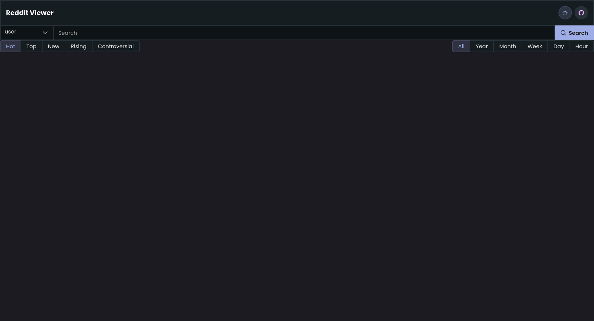
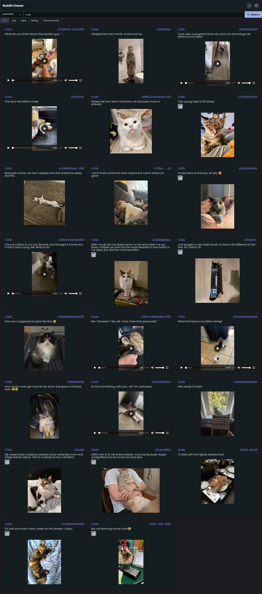
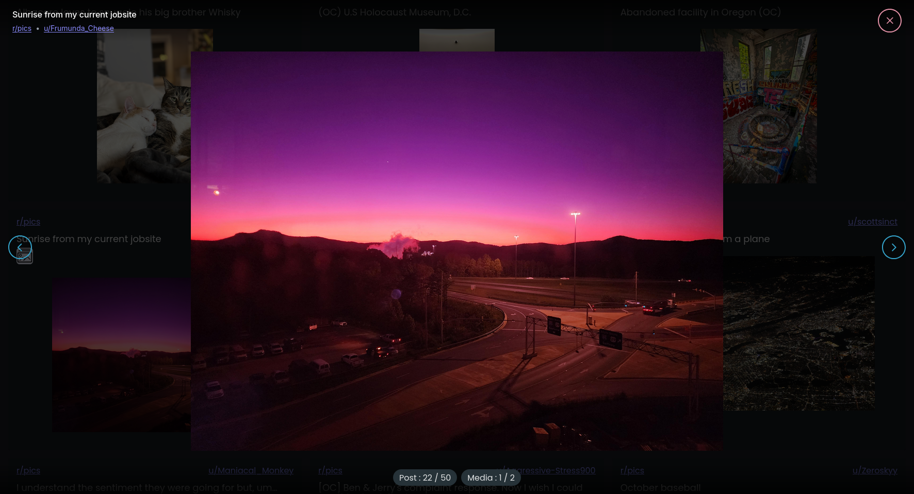

# Reddit Media Viewer 🖼️

A modern fullstack web application that transforms Reddit browsing into a seamless gallery experience. View images, videos, and media from Reddit posts in an elegant, distraction-free interface.

<!-- TODO: Add a banner image or screenshot -->

## ✨ Features

- 🎨 **Clean Gallery Interface** - Browse Reddit media in a beautiful grid layout
- 🔍 **Advanced Search** - Search by keywords, subreddits, or user submissions
- 🎬 **Multi-Media Support** - View images, videos, GIFs, and HLS streams
- 📱 **Responsive Design** - Optimized for desktop and mobile devices
- 🌓 **Theme Toggle** - Switch between light and dark modes
- ⚡ **Infinite Scroll** - Seamlessly load more content as you browse
- 🖼️ **Gallery Albums** - Support for multi-image Reddit galleries
- 🎯 **Lightbox View** - Full-screen media viewer with navigation controls

## 🏗️ Tech Stack

### Frontend

- **Framework**: [Next.js 15](https://nextjs.org/) with React 19
- **Language**: TypeScript
- **Styling**: Tailwind CSS 4
- **UI Components**: [PrimeReact](https://primereact.org/) for polished UI elements
- **State Management**: Jotai for atomic state management
- **Media Player**: React Player for video playback
- **Build Tool**: Next.js with Turbopack

### Backend

- **Language**: Go 1.24
- **Web Scraping**: goquery for HTML parsing
- **Environment**: godotenv for configuration
- **Server**: Native Go HTTP server

## 📸 Screenshots







<!-- TODO: Add search interface screenshot -->

## 🚀 Getting Started

### Prerequisites

- [Go 1.24+](https://golang.org/dl/)
- [Node.js 20+](https://nodejs.org/) or [Bun](https://bun.sh/)
- Git

### Installation

1. **Clone the repository**

    ```bash
    git clone https://github.com/Aninda001/reddit_media_viewer.git
    cd reddit_media_viewer
    ```

2. **Set up the backend**

    ```bash
    cd server

    # Create a .env file for configuration
    cp .env.example .env  # Create this file with your settings

    # Install dependencies
    go mod download

    # Run the server
    go run main.go
    ```

    The backend server will start on `http://localhost:8081` by default.

3. **Set up the frontend**

    ```bash
    cd frontend

    # Install dependencies (using npm)
    npm install

    # Or using Bun
    bun install

    # Create environment file
    echo "NEXT_PUBLIC_API_URL=http://localhost:8081" > .env.local

    # Run the development server
    npm run dev

    # Or with Bun
    bun run dev
    ```

    The frontend will be available at `http://localhost:3000`.

## 🔧 Configuration

### Backend (.env)

Create a `.env` file in the `server` directory:

```env
PORT=8081
```

### Frontend (.env.local)

Create a `.env.local` file in the `frontend` directory:

```env
NEXT_PUBLIC_API_URL=http://localhost:8081
```

## 📖 Usage

1. **Search for Content**
    - Enter keywords, subreddit names, or usernames in the search bar
    - Use filters to sort by relevance, time, or popularity

2. **Browse Media**
    - Scroll through the gallery grid
    - Click on any card to open the full-screen viewer

3. **Navigate in Lightbox**
    - Use arrow buttons or keyboard arrows(Up & Down) to navigate between media
    - Click close or press ESC to close
    - For gallery posts, navigate through multiple images

4. **Filter Options**
    - Search by keyword across all of Reddit
    - Browse specific subreddit content
    - View user submissions

## 🔑 Key Features Explained

### Media URL Transformation

The backend intelligently transforms Reddit's internal media URLs to direct CDN links for optimal performance:

- Image URLs → `i.redd.it`
- Video URLs → `v.redd.it`
- HLS streams → Proper m3u8 playlist URLs

### Gallery Support

Automatically detects and fetches all images from Reddit gallery posts, presenting them as navigable collections.

### Responsive Grid

The gallery uses a responsive CSS grid that adapts to screen size:

- Mobile: 1 column
- Tablet: 2 columns
- Desktop: 3 columns

## 🤝 Contributing

Contributions are welcome! Feel free to open issues or submit pull requests.

1. Fork the repository
2. Create your feature branch (`git checkout -b feature/AmazingFeature`)
3. Commit your changes (`git commit -m 'Add some AmazingFeature'`)
4. Push to the branch (`git push origin feature/AmazingFeature`)
5. Open a Pull Request

## 👤 Author

**Aninda001**

- GitHub: [@Aninda001](https://github.com/Aninda001)
- Project Link: [https://github.com/Aninda001/reddit_media_viewer](https://github.com/Aninda001/reddit_media_viewer)

## 🙏 Acknowledgments

- [Redlib](https://github.com/redlib-org/redlib) for Reddit frontend inspiration
- PrimeReact for beautiful UI components
- Next.js team for an amazing framework
- Go community for excellent libraries

---

⭐ If you find this project useful, please consider giving it a star!
